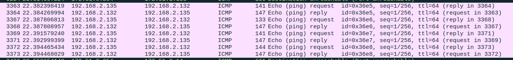
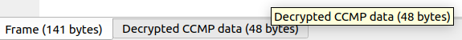

# WPA2-Enterprise - Write-up


## Étape 1 - Extraire les clés MS-MPPE

Le protocole WPA2-Enterprise utilise RADIUS pour authentifier et générer des clés de session.

Avec le secret partagé (`suIdaRHciM`), on peut décoder les échanges RADIUS et récupérer les clés nécessaires au déchiffrement.

Commande utilisée :

```bash
sudo radsniff -I sniffed_radius_exchange.pcapng -s suIdaRHciM -x | grep MS-MPPE-Recv-Key
````

On récupère plusieurs clés :

```text
595d77e272bae6dc7079cf3c9274d77d1a3ed79ade71ed5c65791bfa6b6d46c3
2a6a0fc5b1a022d4b1e7d4b5825c04683caa79e359e22229c6a2e2473c3427e3
27eccd9b70f21996e3d9a7988dae3411fd0444075b1767ae048f02a7ed94a8e0
```

## Étape 2 - Configurer Wireshark

Ouvrir `traffic_capture.pcapng` dans Wireshark.

Ajouter les clés :

* Aller dans :

  ```
  Edit → Preferences → Protocols → IEEE 802.11
  ```
* Activer :

  ```
  Enable decryption
  ```
* Ajouter les clés dans :

  ```
  Decryption keys
  ```

## Étape 3 - Observer le trafic déchiffré

Une fois les clés ajoutées, Wireshark déchiffre le trafic WPA2.

On voit apparaître des paquets ICMP (ping) auparavant chiffrés.



## Étape 4 - Extraire les données

En sélectionnant un paquet ICMP :

  Aller dans :

  ```
  Decrypted CCMP data
  ```



On trouve plusieurs fragments encodés en Base64 :

```text
R29vZCBKb2Is
dGhl
ZmxhZyBpcyA6
V1BBMlI0RElVNQ=
```

## Étape 5 - Décoder le Base64

Assembler puis décoder :

```text
R29vZCBKb2Is dGhl ZmxhZyBpcyA6 V1BBMlI0RElVNQ=
```

Résultat :

```text
Good Job,
the
flag is :
WPA2R4DIU5
```

## Flag final

```text
HSR{WPA2R4DIU5}
```
